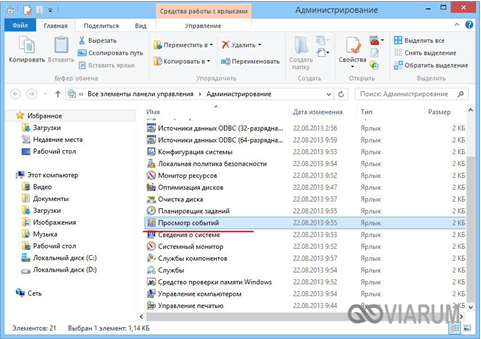
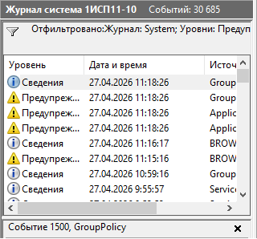
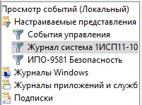
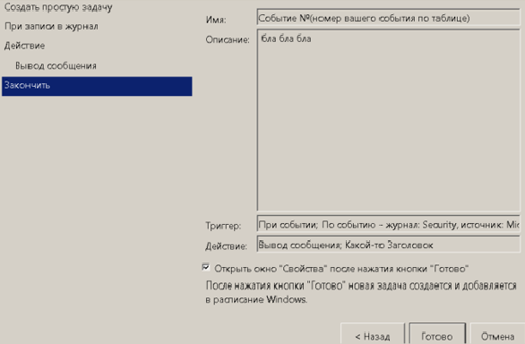
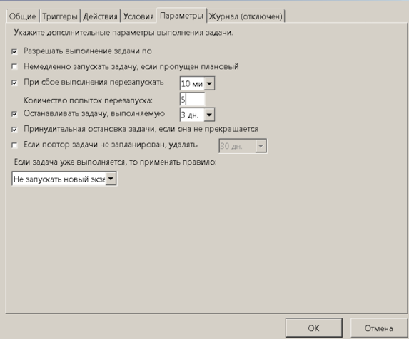
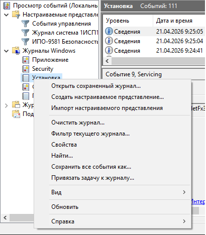
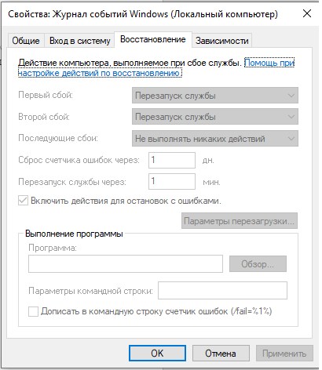

# Лабораторная работа №19
**Работа с журналами событий Windows** 

	
	
**Цель:**  Изучить принцип работы журналов событий ОС Windows 

**Теоретические сведения:**

Даже когда пользователь ПК не совершает никаких действий, операционная система продолжает считывать и записывать множество данных. Наиболее важные события отслеживаются и автоматически записываются в особый лог, который в Windows называется Журналом событий. Но для чего нужен такой мониторинг? Ни для кого не является секретом, что в работе операционной системы и установленных программ могут возникать сбои. Чтобы администраторы могли находить причины таких ошибок, система должна их регистрировать, что собственно она и делает.
Итак, основным предназначением Журнала событий в Windows 7/10 является сбор данных, которые могут пригодиться при устранении неисправностей в работе системы, программного обеспечения и оборудования. Впрочем, заносятся в него не только ошибки, но также и предупреждения, и вполне удачные операции, например, установка новой программы или подключение к сети. 
Физически Журнал событий представляет собой набор файлов в формате EVTX, хранящихся в системной папке %SystemRoot%/System32/Winevt/Logs. 
Хотя эти файлы содержат текстовые данные, открыть их Блокнотом или другим текстовым редактором не получится, поскольку они имеют бинарный формат. Тогда как посмотреть Журнал событий в Windows 7/10, спросите вы? Очень просто, для этого в системе предусмотрена специальная штатная утилита eventvwr.
Запустить утилиту можно из классической Панели управления, перейдя по цепочке Администрирование – Просмотр событий или выполнив в окошке Run (Win+R) команду eventvwr.msc.

В левой колонке окна утилиты можно видеть отсортированные по разделам журналы, в средней отображается список событий выбранной категории, в правой – список доступных действий с выбранным журналом, внизу располагается панель подробных сведений о конкретной записи. Всего разделов четыре: настраиваемые события, журналы Windows, журналы приложений и служб, а также подписки.
Наибольший интерес представляет раздел «Журналы Windows», именно с ним чаще всего приходится работать, выясняя причины неполадок в работе системы и программ. Журнал системных событий включает три основные и две дополнительные категории. Основные это «Система», «Приложения» и «Безопасность», дополнительные – «Установка» и «Перенаправленные события».
Категория «Система» содержит события, сгенерированные системными компонентами – драйверами и модулями Windows.
Ветка «Приложения» включает записи, созданные различными программами. Эти данные могут пригодиться как системным администраторам и разработчикам программного обеспечения, так и обычным пользователям, желающим установить причину отказа той или иной программы.
Третья категория событий «Безопасность» содержит сведения, связанные с безопасностью системы. К ним относятся входы пользователей в аккаунты, управление учётными записями, изменение разрешений и прав доступа к файлам и папкам, запуск и остановка процессов и так далее.
На жестком диске файлы журнала занимают сравнительно немного места, тем не менее, у пользователя может возникнуть необходимость их очистить. Сделать это можно разными способами: с помощью оснастки eventvwr, командной строки и PowerShell. Для выборочной очистки вполне подойдет ручной способ. Нужно зайти в журнал событий, кликнуть ПКМ по очищаемому журналу в левой колонке и выбрать в меню опцию «Очистить журнал».
Если вы хотите полностью удалить все записи журнала, удобнее будет воспользоваться запущенной от имени администратора командной строкой. 

# №4

# №5

# №6

# №7 

# №8

# №9
