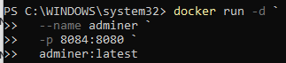
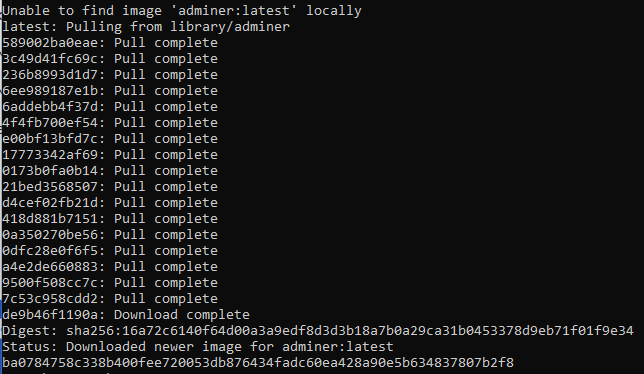
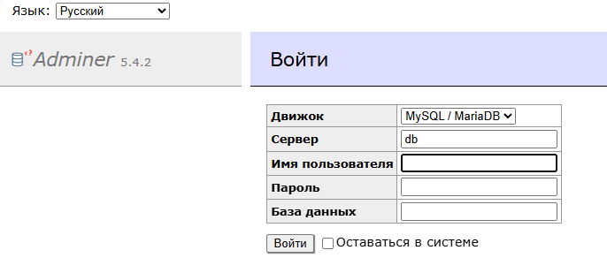

# Adminer
## Запустите Adminer в Windows Powershell
```
docker run -d `
  --name adminer `
  -p 8084:8080 `
  adminer:latest
```

## Запустите Adminer в Git-Bash/Linux/WSL 2.0/Mac
```
docker run -d \
  --name adminer \
  -p 8084:8080 \
  adminer:latest
```




[Откройте: http://localhost:8084](http://localhost:8084)



> Без отдельно запущенного контейнера с БД PostgreSQL и связи с ним админ-панель работаеть не будет!

> Заполнять данные админ-панели не нужно!

Система:
- PostgreSQL
- сервер: host.docker.internal
- логин: postgres
- пароль: mysecretpassword