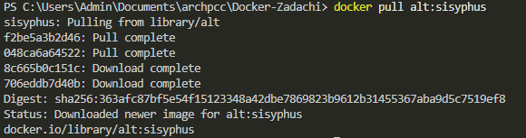
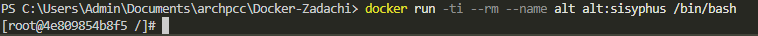
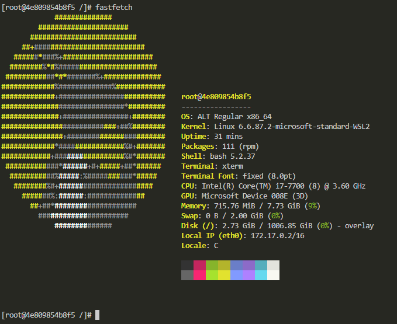
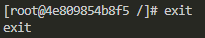

# Alt Linux в Docker
> Никогда в разработке не используйте русские имена файлов и каталогов!

> Никогда в разработке не используйте пробелы и спец.символы в именах файлов и каталогов!!

#### Использовать контейнер с Alt

##### Загрузить готовый образ Alt
```shell
docker pull alt:sisyphus
```


##### Запустить и использовать
```shell
docker run -ti --rm --name alt alt:sisyphus /bin/bash
```


#### Установить приложение Fastfetch в контейнере
```shell
apt-get update && apt-get install fastfetch
```


#### Запустить Fastfetch
```shell
fastfetch
```


##### Выйти из контейнера с Alt
```shell
exit
```
